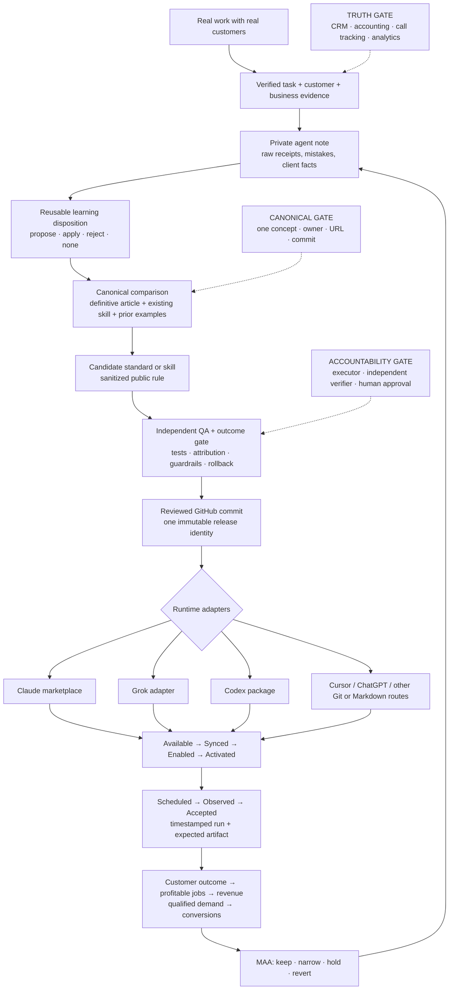

# How our skills learn from real business results

*Implementation article for the public skill source. The canonical concept is
[Recursive Self-Improvement](https://blitzmetrics.com/recursive-self-improvement/);
[The System](https://blitzmetrics.com/the-system/) is its parent map.*

## The promise—and the proof standard

The promise is simple:

> When real work teaches us a better way, that lesson should become a tested,
> reusable instruction that reaches every consenting team and client agent,
> regardless of the model wrapper they prefer.

The proof standard is harder. A lesson is not propagated because somebody said it
in a meeting, wrote an article, pushed a GitHub file, built a plugin, installed a
card, or created a schedule. Those are different states. The loop closes only when:

1. a real task leaves verifiable evidence;
2. the deepest available business result supports the lesson;
3. private facts are separated from the reusable public rule;
4. the candidate survives independent review and automated checks;
5. one immutable Git commit becomes the release identity;
6. each model-specific environment reports that exact accepted version;
7. a clean session activates the changed behavior;
8. a scheduled production run leaves an observed receipt; and
9. the next business result confirms, narrows, or reverses the change.

That is recursive improvement of an external operating system. It is **not model
retraining**. Claude, Codex, Grok, ChatGPT, Cursor, and other agents do not absorb
our private experience into their weights. They read a current, versioned skill
snapshot. The source can improve continuously even while the model wrapper changes.

## The complete loop

The center of the diagram is deliberately GitHub, not a vendor. GitHub is the
reviewed executable source. The canonical article explains the concept. The
private run record preserves evidence that cannot be public. An installed plugin
is a deployed copy. A scheduled task is an invocation. None can substitute for
the others.

## Business outcomes over proxy metrics

Good measurement is a ladder. Use the deepest verified rung, and let it overrule
the shallower ones:

| Priority | Evidence | What it can prove |
|---:|---|---|
| 1 | Customer quality, retention, refunds, collected/recognized revenue, gross profit | The work produced durable business value |
| 2 | Closed sale, completed profitable job, deposit, qualified booking | Qualified demand became business |
| 3 | Qualified lead, connected call, conversion | A real person took a meaningful step |
| 4 | Traffic, rankings, reach, impressions, engagement | Where the funnel may be strengthening or leaking |
| 5 | Posts, pages, words, tasks, audits, trees, or reports produced | Activity happened |

Lower rungs are not useless. They are excellent diagnostics and often move before
revenue. They can start an experiment. They cannot overrule a contradictory
downstream result. A ranking gain with fewer profitable jobs is not a win. More
leads when a business cannot fulfill them may make the business worse. A beautiful
report with disconnected revenue is a measurement task, not verified ROI.

Every proposed business-effectiveness improvement therefore names:

- the source skill and commit;
- the hypothesis and intervention;
- baseline, comparison period, timezone, and sample;
- the primary metric, definition, source, and attribution window;
- alternative explanations or a matched comparison/holdout where practical;
- counter-metrics for capacity, margin, refunds, retention, and customer quality;
- the keep, hold, and revert thresholds; and
- a decision: `propose`, `canary`, `promote`, `hold`, or `revert`.

`scripts/validate_outcome_receipt.py` makes that claim shape machine-checkable.
It refuses to promote a business-effectiveness change from a diagnostic-only
metric. It does not pretend to verify the underlying CRM or accounting record;
an independent reviewer still opens that evidence.

Not every improvement should be forced into a sales claim. A deployment guard may
prove fewer false-green runs. A security rule may prove that injected spam was
caught. A media rule may prove silence before playback. Those use their native
reliability or safety outcome. They must not borrow the language of revenue.

## How a real task becomes public reusable knowledge

### 1. Do and measure the task

The execution agent uses the accepted skill, records its version, and preserves
raw inputs and outputs. It does not rewrite the procedure halfway through and then
pretend the new procedure was what it tested.

### 2. Write the private run record

The private agent note includes what was requested, what happened, what changed,
what was wrong, sources, receipts, and the next action. Client identities,
credentials, private URLs, raw financial data, and sensitive operational details
stay there.

Every substantive note also needs a learning disposition:

- `proposed` — reusable, but not yet accepted;
- `applied` — linked to the skill/standard and resulting commit;
- `rejected` — tested and not supported; or
- `none` — no reusable lesson, with a reason.

Without that link, documentation and recursive improvement are two neighboring
systems, not one loop.

### 3. Compare with canonical truth

Before creating another “how we do this” page, the agent checks the
[Canonical Directory](https://blitzmetrics.com/canonical/), the definitive article,
the current skill, prior meta-articles, and any contradictory evidence. One concept
gets one public canonical URL. A vertical example, prompt, implementation article,
or sales page is a child—not a competing master.

### 4. Sanitize the reusable rule

The public artifact contains the transferable mechanism and enough evidence to
evaluate it, without copying private client facts. “Build in public” means the
method, source, diff, tests, decision, and limitations are inspectable. It does
not mean publishing customer data.

### 5. Review before teaching the fleet

A harvester may draft a branch and pull request. It must not silently merge a
lesson into canonical instructions. Automated validation catches structural drift;
another agent or human checks the reasoning and evidence; a canary checks behavior.
The agent that produced a persuasive result is not the only grader of that result.

### 6. Merge one release identity

The accepted Git commit is the identity. A filename, ZIP timestamp, plugin badge,
or agent summary is not. Every adapter/package should record the source commit,
source-tree hash, build time, adapter version, and sorted skill-inventory hash.
Dirty local builds and unexplained overlays are drift.

### 7. Prove the last mile

For each named environment, record only the state proved:

`Available → Synced → Enabled → Activated → Scheduled → Observed → Accepted`

A GitHub push reaches **Available**. A named environment reporting the accepted
commit reaches **Synced**. A clean-session trigger reaches **Activated**. A schedule
definition reaches **Scheduled**. A timestamped firing with its expected artifact
or unedited error reaches **Observed**. Passing canary assertions with rollback
recorded reaches **Accepted**.

This vocabulary prevents the most dangerous green report: “everything propagated”
when only the source repository changed.

## How the same source reaches different agents

The canonical executable source is
[`dennisyu/local-service-spotlight-skills`](https://github.com/dennisyu/local-service-spotlight-skills).
Every immediate `skills/<slug>/SKILL.md` defines one skill. The aggregate pack is
`lss-everything`, a manifest selection over those same 28 directories—not another
copy. On a Mac that already has the clone, `~/Projects/blitzmetrics-skills/skills`
is the same source tree; the older local folder name is not the repository identity.

The durable behavior lives in `skills/*/SKILL.md` and shared rules generated into
`AGENTS.md` and the skills. Adapters are thin discovery and packaging layers:

| Agent surface | Current public route | Honest status |
|---|---|---|
| Claude | `.claude-plugin/marketplace.json` | Canonical manifest and official repository validation; account sync still needs a receipt |
| Grok | `.grok-plugin/plugin.json` | Reads the same skills; version parity is now checked; account activation still needs a receipt |
| Codex | Surface-specific skill/plugin package | The public skills are portable, but a canonical clean-build adapter and installed-SHA receipt are still open work |
| Cursor | Git checkout plus supported workspace/global instruction wiring | Portable Markdown is available; loaded paths and commit need a cold-start receipt |
| ChatGPT or a custom GPT | Supported workspace skill/plugin or knowledge snapshot | The wrapper may be useful, but it is a deployed snapshot, never the source of truth |
| Any other agent | Git/Markdown import preserving each skill contract | Compatible in principle; working only after a surface-specific receipt |

This makes the “custom GPT” debate mostly irrelevant. A custom GPT may be useful,
limited, unfashionable, or replaced by another bot. The method survives because its
canonical instructions and history do not live only inside that wrapper.

## How global instructions actually update

This exact Codex task demonstrates the distinction.

At task start, Codex loaded global `AGENTS.md` instructions and a deployed plugin
inventory. Those instructions told the agent to read the newest private run notes,
check canonical sources, preserve client privacy, and write an agent note after the
job. The skill list exposed the current deployed copies.

But a sentence Dennis says in a chat does **not** instantly rewrite every agent's
global instructions. The real path is:

1. capture the instruction or evidence in the same session;
2. decide whether it is a direct rule, a hypothesis, or a private one-off;
3. update one source standard or skill on a branch;
4. run `scripts/sync_shared_rules.py` so the applicable rule enters `AGENTS.md`
   and every distributed skill;
5. pass tests and human/independent review;
6. merge a versioned commit;
7. rebuild or sync each runtime adapter from that commit; and
8. start a clean session and save the activation receipt.

Active sessions should not be assumed to hot-reload. A new source file is not the
same as a new installed instruction. That is why the loaded commit matters more
than the model name.

## Specific examples: what the system has already learned

### The black-button rule existed publicly and still failed

The no-black-button rule was published on 17 May 2026, with an article and an
enforcement plugin. On 15 August, an agent with the skill pack in context still
shipped a black CTA. The rule had never entered `standards/`, so no sync stamped
it into the instructions agents actually read. The lesson was not “remind the
designer harder.” It was: a public article is not an executable instruction.

That incident produced `standards/no-black-buttons.md`, shared-rule propagation,
and tests. The standard now travels inside every applicable skill.

### One spoken-path rule became content, checklist, and software

[Commit `6f8012a`](https://github.com/dennisyu/local-service-spotlight-skills/commit/6f8012a44e282ad093b2d0048aea02402a462633)
turned “every URL said aloud must resolve” into a reusable standard, executable
checks, and fixes for actual 404 paths. One rule produced the teaching content,
pre-flight checklist, and machine sweep.

### Live onboarding became a reusable skill

[Commit `c48602a`](https://github.com/dennisyu/local-service-spotlight-skills/commit/c48602a215ef0990401b97fac6cb8d0d8313a534)
converted a live onboarding thread into `one-session-client-onboarding`: the agent
prefills the Goals–Content–Targeting brief, the client confirms and grants access,
and the first Friday MAA becomes the certainty date. This is the good form of
experience propagation: a real task became a named capability other agents can run.

### Forty-nine audits were not a system

A 2026-08-03 inventory found 49 published SEO audits and 341 audit-family URLs,
but no `seo-audit` skill file. Thirty-eight audits had no inbound link from a
sibling and 35 had no outbound sibling link. Three learning notes were waiting for
a skill slug that did not exist. Creating the canonical skill was more important
than writing a fiftieth audit: a capability with no skill cannot propagate, teach,
or absorb lessons.

### A large metric movement was reclassified as spam

One field run found 385 of 398 referring domains were spam, and every newly gained
domain in that comparison was spam. The honest action was to withdraw the Domain
Rating growth narrative, not celebrate the larger number. Another compromised-site
run corrected a score from 40 to 21 after hostile ranking terms were classified.
These examples improve diagnostic integrity; they do not by themselves prove sales.

### The client corrected four weeks of agent certainty

For four reports, an agent claimed a large transcript library was invisible to
crawlers because rendered visible text looked short. A raw served-HTML check showed
59,761 characters and 97 speaker turns were present. The client's objection was
right. The lasting rule became: test crawlability on served HTML, and test the
client's version first when they dispute a technical claim.

### Capacity overruled the lead-generation recommendation

In a private 2026-08 service-business case, verified staffing, utilization, pricing,
volume, and average-order economics showed that fulfillment capacity—not demand—
was the limiting stage. The recommendation changed from buying more leads to fixing
the operating constraint, and the follow-up recorded a purchased advisory engagement.
The raw customer facts remain private; the reusable public rule now sits in
`measurement-analytics`: check fulfillment, margin, backlog, and customer quality
before prescribing demand.

### This audit caught propagation claims that the live deployment disproved

The public Claude manifest was version 1.1.2 while the Grok adapter was 1.1.1.
Several public documents still said 27 skills after the manifest reached 28. More
importantly, the installed Codex package audited in this task had an older canonical
skill set, one private add-on, one missing public skill, and a newer-looking version
label. Repository validation was green; the live deployment still drifted.

This candidate aligns the two public adapters at 1.2.0 and adds a parity test. It
does not claim that any named account has synced 1.2.0; that remains a downstream
acceptance receipt.

That is the clearest reason to trust but verify: version labels and GitHub success
are diagnostics. The loaded commit, inventory hash, clean-session behavior, and
observed run are the proof.

The same audit found another last-mile gap: anonymous agent fetches of the proposed
canonical page, Meta-Article Prompt, Building in Public, and Task Library returned
HTTP 403 or could not be opened, while the public GitHub commits were readable. This
does not prove the pages are unavailable to human browsers. It proves that public
machine readability is not accepted yet. The canonical site needs a logged-out,
multi-user-agent crawlability receipt and a narrowly scoped WAF fix if legitimate
agents remain blocked.

## The top five changes from the 20 August 2026 audit

| Priority | Finding | Change made in this candidate | What remains |
|---:|---|---|---|
| 1 | Recursive QA could publish a procedural improvement without a business-outcome gate | Added metric precedence, baseline/window/attribution/guardrail requirements, explicit decisions, and a machine-checkable outcome receipt | Attach at least one fully joined revenue pilot and later skill-change receipt |
| 2 | Private agent notes and applied skill learnings were separate streams | Required every substantive run to carry a learning disposition and affected skill/commit; added a paired private-runtime note schema and changed-note CI gate | Automate the one-day cross-repository unmatched-note gate and clear the existing learning backlog |
| 3 | Claude, Grok, and live Codex versions/inventories disagreed | Enforced Claude/Grok version parity and documented one immutable-source adapter contract | Build and accept clean canonical Codex, Cursor, and ChatGPT routes |
| 4 | Repository consistency was being mistaken for account propagation | Added cross-runtime cold-start and scheduled-run acceptance receipts | Populate the currently empty per-environment register |
| 5 | Counts and descriptions were hand-maintained and already stale | Added validation for current-count claims and removed repeated literals where possible | Apply the same derive-don't-maintain gate to the Task Library and public directory |

These are source-level fixes, not proof that every downstream environment updated.
The pull request, checks, merge, adapter sync, fresh-session tests, and production
receipts are intentionally separate.

## The broader non-obvious opportunity list

The audit also surfaced these leverage points, in priority order after the top five:

1. A mirror on a slower clock than its source is a fork. Match cadence and hash-check it.
2. A capability with no canonical skill file cannot learn, even if hundreds of outputs exist.
3. “Not connected” is not zero. Unknown funnel stages stay unknown until measurement exists.
4. Capacity, margin, and customer quality can override a demand-generation diagnosis.
5. A harvester should draft a pull request, never silently teach the whole fleet.
6. Queue age is a better learning-loop health metric than notes produced.
7. A dirty local package cannot claim canonical provenance, even when its version is newer.
8. A model-specific prompt, GPT, bot, or cache is a wrapper; keep the source outside it.
9. Scheduled is not observed. A missing receipt after the grace period is a failure state.
10. Fresh-session activation is the only honest check that global instructions arrived.
11. Every hardcoded artifact count becomes wrong on the day a new item is added.
12. A subject or client who says an artifact is wrong outranks the generated artifact.
13. A metric must be classified, not merely counted—spam, hostile terms, and namesakes matter.
14. Client evidence can stay private while the sanitized rule and validation logic stay public.
15. The recursive skill itself should eventually route historical field notes to references;
    a huge instruction file can bury its governing algorithm.
16. Task “complete” should require a resolving canonical article and one receipt-backed example.
17. The candidate canonical-registry entry for recursive self-improvement must merge, then
    its parent/child links and aliases need a live-site canonical/redirect check.
18. No claim of fleet-wide automatic propagation should survive without current environment
    receipts for every named model surface.
19. A public canonical page that legitimate agents receive as HTTP 403 cannot teach those
    agents; machine readability needs its own logged-out acceptance matrix.

## How anyone can use and improve the system

Anyone may inspect the public source, install a supported adapter, or copy a skill
through a runtime's supported Markdown/Git workflow. For a recurring task:

1. install/sync an accepted commit;
2. use a clean-session trigger to prove the skill loads;
3. schedule a complete standalone prompt naming the skill, inputs, destination, and owner;
4. alert on a missing receipt, not only an explicit error;
5. measure the deepest available customer/business result;
6. write the run and learning disposition;
7. propose a sanitized change by branch and pull request; and
8. let independent evidence—not model confidence—decide whether to keep it.

Public contributors should bring reproducible examples, counterexamples, tests, and
source definitions. Client-specific facts belong in the private receipt. This keeps
the system transparent without turning transparency into a privacy failure.

## The Golden Rule underneath the machinery

The technology is incidental. The operating model is old-fashioned:

- tell the truth about what happened;
- help real people who do good work for real customers;
- amplify proof, reviews, expertise, and useful teaching;
- fix the process when it fails instead of blaming the person;
- share the reusable lesson so the next person starts further ahead; and
- let customer benefit and durable business value overrule marketing theater.

The Content Factory multiplies reputation; it should not manufacture one. SEO,
advertising, AI visibility, and automation help good people win when they carry
verifiable proof into places the right customers can find it. The same recursive
loop keeps the amplification honest: measure, analyze, act, document, verify,
propagate, and measure again.

## Release receipt for this article

This article is the public implementation source proposed on 20 August 2026. Its
accepted Git commit, pull-request checks, and downstream activation receipts belong
in the release record; they are not inferred from the existence of this file.

Related sources:

- [Acceptance checks and receipts](ACCEPTANCE.md)
- [Contribution and review route](CONTRIBUTING.md)
- [Skill distribution matrix](skills/skill-registry/references/distribution.md)
- [Skill update contract](skills/skill-registry/references/update-contract.md)
- [Business-impact standard](standards/report-business-impact-not-volume.md)
- [Capture-learning standard](standards/capture-what-you-learn.md)
- [Canonical Directory](https://blitzmetrics.com/canonical/)
- [Task Library](https://blitzmetrics.com/task-library/)
- [Building in Public](https://blitzmetrics.com/building-in-public/)
- [Skill Packs Self-Improvement Loop](https://blitzmetrics.com/skill-packs-self-improvement-loop/)
